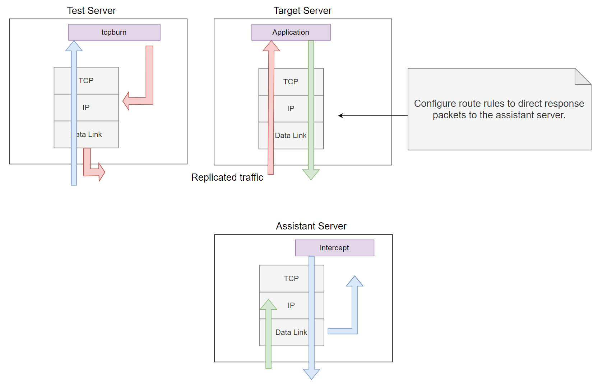

# A TCP Stream Replay Tool for Concurrency


## Description
TPCBurn is a replay tool designed specifically for concurrency. It can stress-test any TCP-based application that supports replay functionality.


## Characteristics
1. Network latency can be preserved.
2. There's no need to bind multiple IP addresses, and the number of client IP addresses is unlimited.
3. The maximum number of concurrent users is limited by bandwidth, memory, and CPU processing power.
4. Only TCP-based applications that support replay are supported.

## Scenarios
1. Stress Testing
2. Comet
3. Performance Testing


## Architecture



Figure 1. Overview of the TCPBurn Architecture.

As shown in the figure above, TCPBurn consists of two components: `tcpburn` and `intercept`. 

- **`tcpburn`** runs on the test server and sends packets from pcap files. It reads packets, performs necessary processing such as simulating TCP interactions, controlling network latency, and simulating common upper-layer interactions. By default, it uses a raw socket output technique to send packets to the target server (indicated by light pink arrows).

- **`intercept`** operates on the assistant server and performs supporting tasks, such as passing response information to `tcpburn`. It captures response packets, extracts response header information, and sends this information to `tcpburn` through a special channel (indicated by light blue arrows). When `tcpburn` receives the response header, it uses the header information to modify pcap packet attributes and continues sending additional packets.

The only action required on the target server for TCPBurn is to set appropriate route rules to direct response packets (indicated by light green arrows) to the assistant server. Note that the assistant server should act as a black hole for responses from the target server.


## `tcpburn` Configure Options
- `--with-debug`      Compile `tcpburn` with debug support (output saved in a log file).
- `--pcap-send`       Send packets at the data link layer instead of the IP layer.
- `--single`          If `intercept` is configured with the `--single` option, use this option for `tcpburn` as well.
- `--comet`           Replay sessions for Comet applications.


## Installation and Running

### 1. intercept
a) Install `intercept` on the assistant server
```
git clone git://github.com/session-replay-tools/intercept.git
cd intercept
./configure --single
make     
make install
```

b) **On the Assistant Server Running `intercept` (Root Privilege or CAP_NET_RAW Capability Required):**

```
./intercept -F <filter> -i <device>
```

Note that the filter format is the same as the pcap filter. For example:

```
./intercept -i eth0 -F 'tcp and src port 80' -d
```

In this example, `intercept` will capture response packets from a TCP-based application listening on port 80, using the eth0 network device.

### 2. **On the Target Server Running Server Applications:**

Configure the `route` rules to direct response packets to the assistant server. For example, if `65.135.233.161` is the IP address of the assistant server, use the following route command to direct all responses from clients in the `62.135.200.x` range to the assistant server:

`route add -net 62.135.200.0 netmask 255.255.255.0 gw 65.135.233.161`


### 3. `tcpburn` (root privilege or the CAP_NET_RAW capability is required when running)
a) Install `tcpburn` on the test server
```
git clone git://github.com/session-replay-tools/tcpburn.git
cd tcpburn

if not comet scenarios
  ./configure --single 
else
  ./configure --single --comet
endif

make
make install
```

b) **Running `tcpburn` on the Test Server(root privilege or the CAP_NET_RAW capability is required):**

```
./tcpburn -x historyServerPort-targetServerIP:targetServerPort -f <pcapfile,> -s <intercept address> -u <user num> -c <ip range,>
```

For example, assume:

- **65.135.233.160** is the IP address of the target server.
- **10.110.10.161** is the internal IP address of the assistant server.
- **65.135.233.161** is the external IP address of the assistant server.

You would use the following command:

```
./tcpburn -x 80-65.135.233.160:80 -f /path/to/80.pcap -s 10.110.10.161 -u 10000 -c 62.135.200.x
```

`tcpburn` extracts packets from the `80.pcap` file, destined for port 80, and replays them to the target server at **65.135.233.160**, where an application listens on port 80. It replays a total of 10,000 sessions, using client IP addresses from the **62.135.200.x** range. `tcpburn` connects to the assistant server at **10.110.10.161** to obtain response information.


## Note
1. All sessions are retrieved from pcap files; ensure the sessions in the pcap files are complete.
2. By default, `tcpburn` uses raw sockets to send packets. To avoid ip_conntrack problems or achieve better performance, configure `tcpburn` with `--pcap-send` and refer to `./tcpburn -h` for instructions on setting the appropriate parameters.
3. The test server and the assistant server can be on the same machine.
4. For Comet applications, exclude publish sessions if they are present in the pcap files.
5. tcpburn cannot replay TCP-based sessions that cannot be replayed, such as SSL/TLS sessions.
6. `ip_forward` should not be enabled on the assistant server.
7. Root privileges or the CAP_NET_RAW capability are required.
8. Execute `./tcpburn -h` or `./intercept -h` for more details.


## Release History
+ 2014.09  v1.0    TCPBurn released
+ 2024.09  v1.0    Open source fully uses English

## Bugs and Feature Requests
Have a bug or a feature request? [Please open a new issue](https://github.com/session-replay-tools/tcpburn/issues). Before opening any issue, please search for existing issues.


## Copyright and License

Copyright 2024 under [the BSD license](LICENSE).
